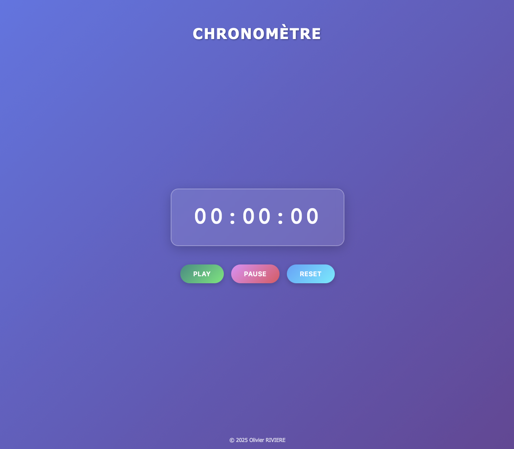

# ⏱️ JavaScript Stopwatch

A modern and elegant stopwatch with glassmorphism interface. Vanilla JavaScript project built to master time management, intervals, and state handling in JavaScript.

## ✨ Features

- Accurate stopwatch in HH:MM:SS format
- Functional Start, Pause, and Reset buttons
- Modern interface with glassmorphism effect
- Color gradients for each button
- 100% responsive design (mobile, tablet, desktop)
- Smooth hover animations
- Vanilla JavaScript code (no framework)

## 🚀 Live Demo

[View Live Demo](https://olivier-RIVIERE.github.io/stopwatch)

## 🛠️ Built With

- **HTML5** - Semantic structure
- **CSS3** - Modern design with gradients and glassmorphism
- **JavaScript (ES6+)** - Time logic and state management

## 📦 Installation

1. **Clone the repository**
- git clone https://github.com/your-username/stopwatch.git
- cd stopwatch

2. **Open the HTML file**
open index.html

Or with Live Server (VSCode)

## 💻 Project Structure

- `index.html` - HTML structure
- `style.css` - Styles and design
- `script.js` - JavaScript logic
- `README.md` - Documentation

## 🎯 Skills Developed

- Time management with `setInterval` and `clearInterval`
- Time formatting with mathematical calculations (modulo, division)
- State management (stopwatch active/inactive)
- DOM manipulation
- `padStart()` method for formatting
- Modern CSS (glassmorphism, gradients, animations)
- Responsive design with media queries

## 📖 About This Project

This project was created as part of my web development learning journey. The goal was to understand time management in JavaScript, the concepts of `setInterval`/`clearInterval`, and to create a modern interface for my GitHub portfolio.

## 🤝 Contributing

Contributions, suggestions, and improvements are welcome! Feel free to:
- Open an issue to report a bug
- Suggest new features
- Submit a pull request

## 📝 License

This project is licensed under the MIT License.

## 👤 Author

**Olivier RIVIERE**

- GitHub: [@Olivier-RIVIERE](https://github.com/Olivier-RIVIERE)
- My portfolio: [Olivier RIVIERE](https://portfolio-olivier-riviere.vercel.app)
- LinkedIn: [Olivier RIVIERE](https://www.linkedin.com/in/olivierriviere/)

---

⭐ If you liked this project, feel free to give it a star!

